# Prototipna dokumentacija

**Predmet:** Tehnologije za vseprisotne aplikacije  
**Projekt:** Smart Health Assistant  
**Študijsko leto:** 2025/2026  
**Vodja ekipe:** Tanej Buhin  
**Datum:** 21. 4. 2026

---

## 1. Uvod

Ta dokument predstavlja prototipno dokumentacijo za mobilno aplikacijo **Smart Health Assistant**, pripravljeno na podlagi dokumenta *Priprava na projekt*.  
V dokumentaciji so vključeni:

- diagram primerov uporabe,
- E-R diagram podatkovne baze,
- prototipi zaslonskih mask.

Namen aplikacije je uporabniku omogočiti enostavno beleženje zdravstvenih podatkov, upravljanje zdravil, pregled zgodovine vnosov ter podporne AI funkcionalnosti. Aplikacija je podporna rešitev za samonadzor zdravja in **ni** diagnostično orodje.

---

## 2. Diagram primerov uporabe (Use Case Diagram)

Spodnji UML diagram prikazuje glavne akterje in ključne primere uporabe sistema.


Vir diagrama: `usecase.mmd`

---

## 3. E-R diagram podatkovne baze

Podatkovni model podpira lokalno shranjevanje (Room), povezave med uporabnikom, vnosi simptomov, meritvami, zdravili, opomniki in AI povzetki.


Vir diagrama: `er.mmd`

---

## 4. Prototipi zaslonskih mask (low-fidelity)

Spodaj so opisani prototipi ključnih zaslonov. Skice so namenjene usmerjanju razvoja uporabniškega vmesnika.

## 4.1 Navigacijski tok zaslonov


Vir diagrama: `navigation.mmd`

## 4.2 Vizualni prototipi zaslonskih mask (premium, 10 ločenih slik)

Spodaj so vključeni moderni premium mockupi po posameznih funkcionalnostih (temni nacin, karticni UI, poudarjeni CTA elementi in ikone).

### 4.2.1 Registracija in zdravstveni profil
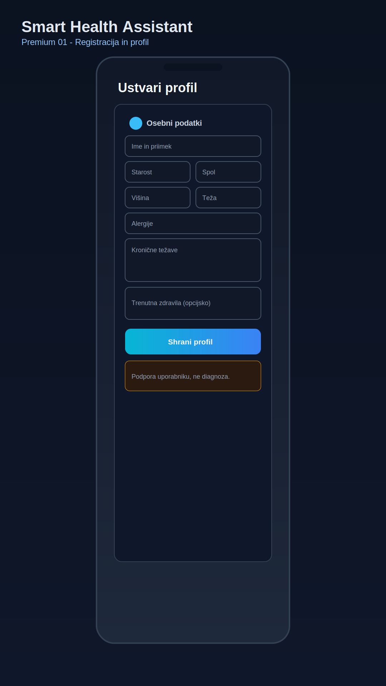

### 4.2.2 Nadzorna plošča
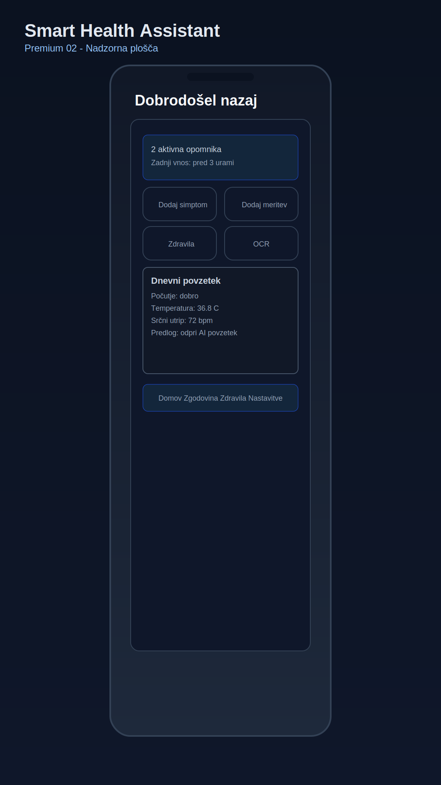

### 4.2.3 Beleženje simptomov in govorni vnos
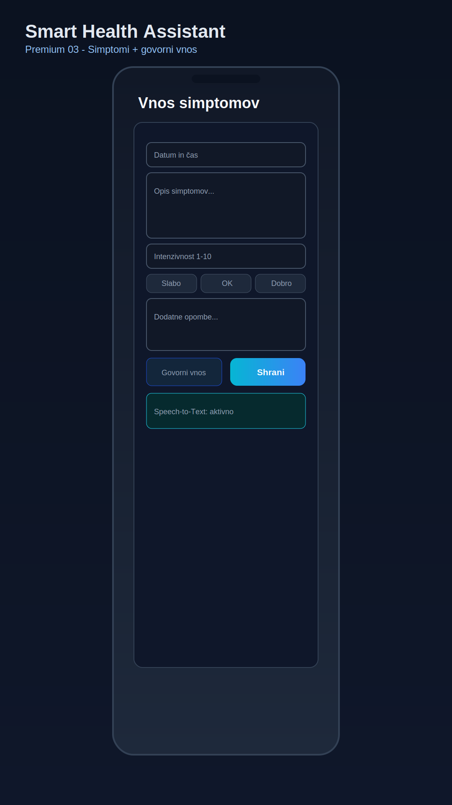

### 4.2.4 Vnos meritev
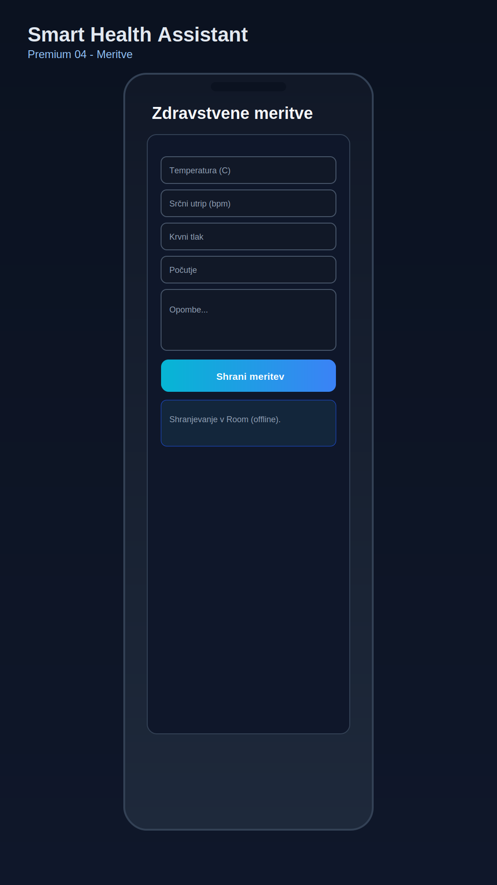

### 4.2.5 Upravljanje zdravil in opomniki
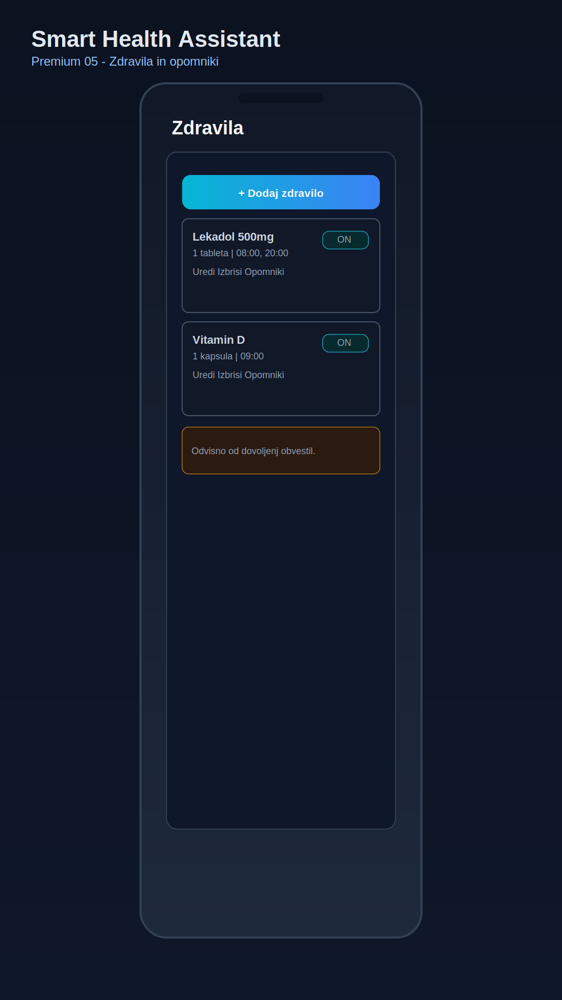

### 4.2.6 Pridobivanje informacij iz API
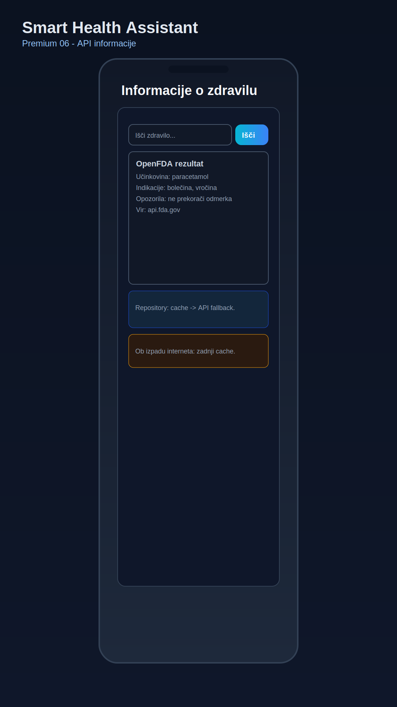

### 4.2.7 OCR skeniranje embalaže/navodil
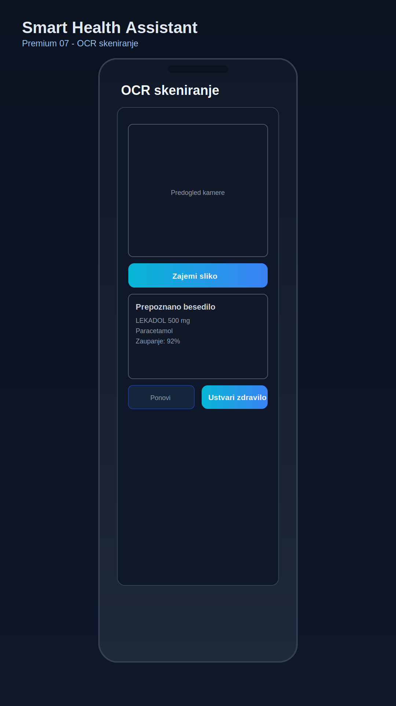

### 4.2.8 AI povzetek uporabniškega stanja
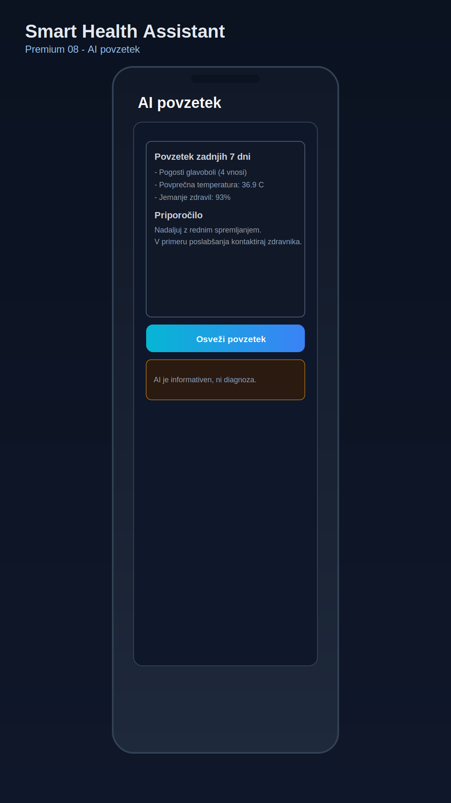

### 4.2.9 Zgodovina in offline predpomnjenje
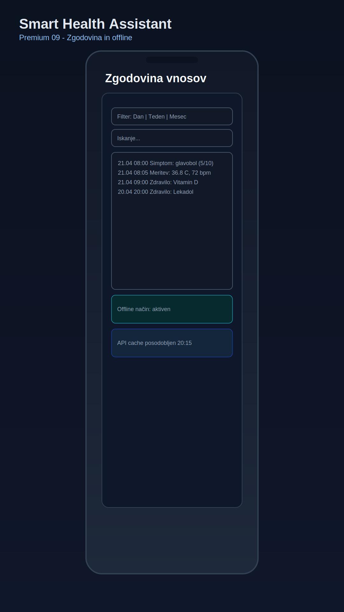

### 4.2.10 Večjezični vmesnik in nastavitve
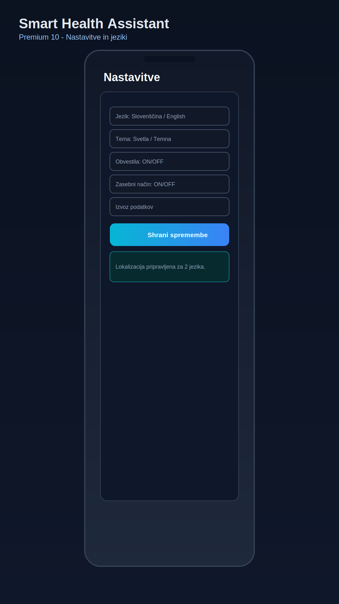

### 4.3 Pokritost funkcionalnosti

S tem sklopom prototipov so vidno pokrite vse načrtovane funkcionalnosti:

- registracija in urejanje profila,
- beleženje simptomov, počutja in meritev,
- upravljanje zdravil in opomniki,
- lokalno shranjevanje in offline delovanje,
- pridobivanje informacij iz zunanjega API,
- glasovni vnos simptomov,
- OCR prepoznava besedila,
- AI povzetek stanja,
- predpomnjenje API podatkov,
- večjezični vmesnik in prilagodljive nastavitve.

---

## 5. Tehnološki okvir

Predvidena implementacija temelji na naslednjih tehnologijah:

- `Kotlin` in `Android Studio` za razvoj Android aplikacije,
- `Room` za lokalno relacijsko podatkovno bazo,
- `Retrofit` za dostop do spletnih API storitev (npr. OpenFDA),
- `SpeechRecognizer` za pretvorbo govora v besedilo,
- `ML Kit OCR` za prepoznavo besedila s slik,
- zunanja AI/LLM storitev za generiranje informativnih povzetkov.

---

## 6. Zaključek

Prototipna dokumentacija opredeljuje ključne funkcionalnosti, podatkovni model in uporabniške zaslone aplikacije **Smart Health Assistant**.  
Dokument predstavlja osnovo za implementacijo in nadaljnje iterativno izboljšave v okviru razvoja projekta.

**Pomembno:** aplikacija je namenjena podpori uporabniku pri spremljanju zdravja in ne nadomešča strokovne medicinske obravnave.
